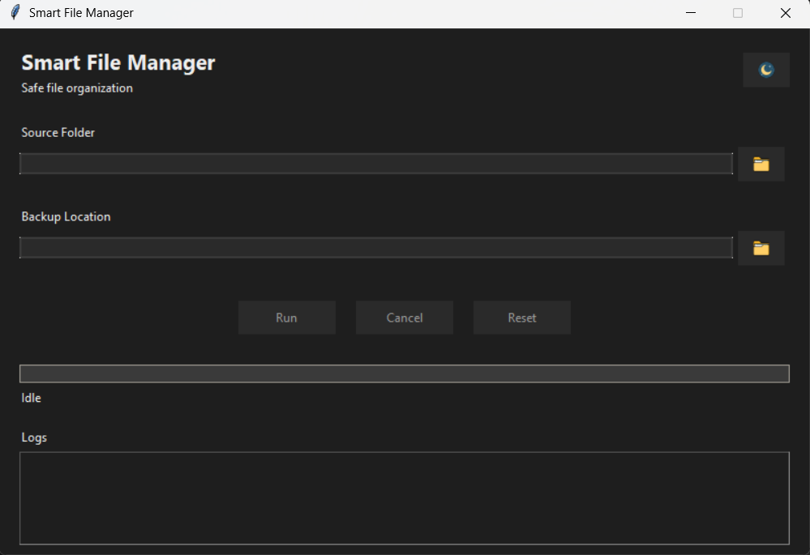
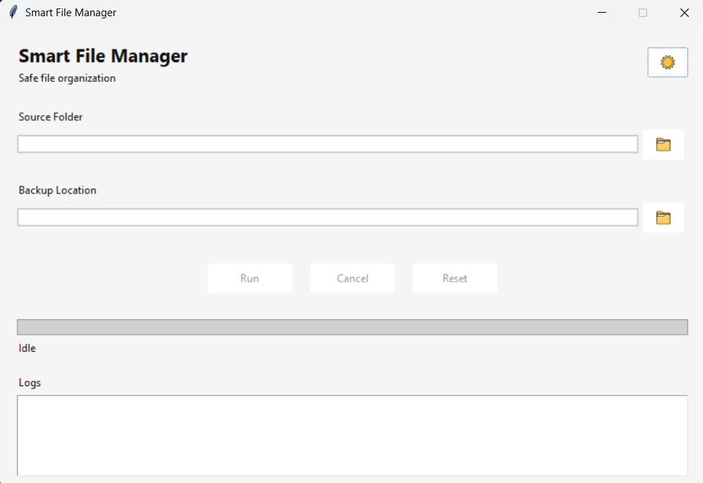
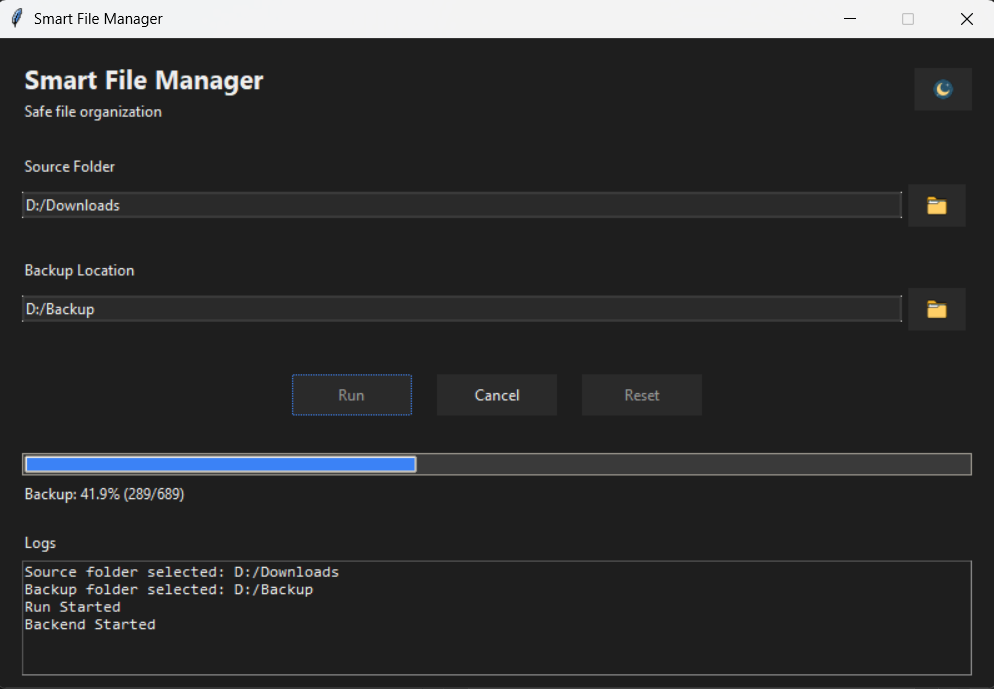

# Smart File Manager

A **safe and reliable Python desktop application** for organizing files with backup, staging, rollback, cooperative cancel, and live progress all in a responsive Tkinter UI.

---

## 🚀 Overview

Smart File Manager is designed to **organize files safely** from a source folder by:

- creating a **backup** first,
- preparing a **staging area**,
- organizing files into categories,
- and applying changes only when safe.

It prevents data loss, supports cancellation at safe checkpoints, and performs rollback on failure.

---

## 💡 Motivation

Many folders—especially downloads tend to become cluttered over time, making it difficult to locate files or maintain structure.

This project was created to solve that exact problem:  
to safely organize messy folders **without risking data loss**, while still giving users control and transparency over the process.

---

## 🎯 Key Features

✔ Automatic backup before any changes  
✔ Staging for safe file organization  
✔ Real-time per-file progress updates  
✔ Cooperative cancel (safe checkpoints only)  
✔ Apply phase is atomic (no mid-cancel)  
✔ Threaded UI (responsive during long operations)  
✔ Dark & Light theme toggle  
✔ Clean rollback on failure

---

## 📸 Screenshots

- Dark Theme
  

- Light Theme
  

- Working State
  

---

## 📥 Download (Windows)

The easiest way to use it:

👉 Download the executable from the latest release:

https://github.com/Eakempreet/smart-file-manager/releases/latest

No installation or Python required.

---

## ▶️ How to Run

Just double-click the downloaded `SmartFileManager.exe` on Windows.

1. Select **Source Folder**
2. Select **Backup Location**
3. Click **Run**
4. Watch progress and let it finish

---

## 🛠 How It Works (High Level)

1. **Backup**:
   - Copies all files to a backup folder
   - Safe cancel between files

2. **Staging**:
   - Copies to staging directory
   - Cancel allowed here

3. **Organizing**:
   - Categorizes files in staging

4. **Apply**:
   - Applies organized structure to original
   - Atomic and not cancellable

5. **Rollback**:
   - Restores from backup if apply fails

---

## 📦 Run from Source (Developers)

If you want to use or modify the source:

```bash
git clone https://github.com/Eakempreet/smart-file-manager.git
cd smart-file-manager
```

Create and activate a virtual environment (Windows PowerShell):

```powershell
python -m venv .venv
.\.venv\Scripts\Activate.ps1
python -m pip install --upgrade pip
```

Run the app:

```powershell
python run.py
```

---

## 🧠 Architecture

**This project uses:**

- Separation of concerns: UI vs backend logic
- Threading: keeps UI responsive
- Queue communication: backend → UI updates
- Callback hooks: for progress reporting
- Safe checkpoints: for cooperative cancel

---

## 🧪 Build Your Own EXE

**If you want to generate a Windows executable:**

```bash
python -m pip install --upgrade pyinstaller
pyinstaller --noconfirm --clean --onefile --windowed --name SmartFileManager --add-data "assets_ui;assets_ui" run.py
```

Then your EXE will be in:

```
dist/SmartFileManager.exe
```

Notes:

- The `--add-data "assets_ui;assets_ui"` part is required so icons/screenshots can be bundled.
- The app loads bundled assets using a PyInstaller-safe path (`sys._MEIPASS`).

---

## 🧯 Troubleshooting

- **Icons missing / crash about `assets_ui/...png`**: rebuild with `--add-data "assets_ui;assets_ui"`.
- **Cancel doesn’t stop instantly**: cancel is cooperative (it stops at safe checkpoints).
- **Staging folder not deleting on Windows**: Explorer/antivirus can temporarily lock files; try again or delete manually.

---

## 🤝 Contributing

**Contributions are welcome!**
**Open an issue or submit a pull request.**

---

## 🙌 Acknowledgements

AI-assisted tools (such as GitHub Copilot) were used during development to speed up iteration and reduce boilerplate.  
All architectural decisions, safety constraints, and final implementations were designed, reviewed, and validated manually.

---
